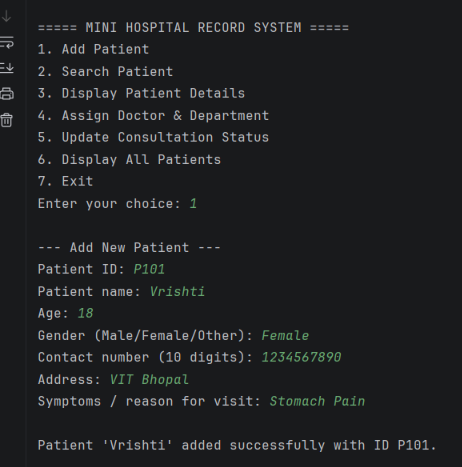
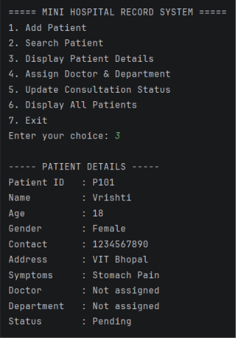
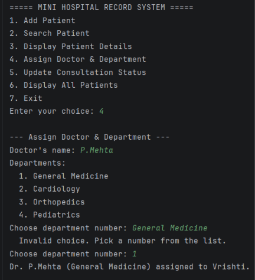
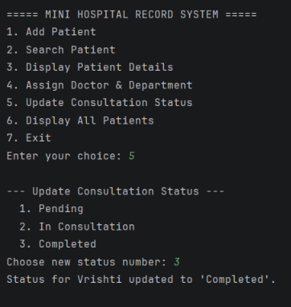
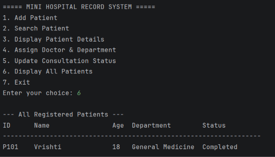
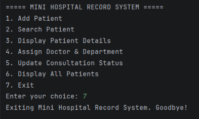

# Mini Hospital Record System

A console-based patient record management system built in Python, developed as a VITyarthi mini project.

## Overview
The Mini Hospital Record System lets front-desk staff register patients, search their records, assign doctors and departments, and track consultation status, all through a menu-driven command-line interface.

## Features
- Add new patients with validated details (ID, name, age, gender, contact)
- Search patients by ID and display full details
- Assign a doctor and department to a patient
- Update consultation status (Pending / In Consultation / Completed)
- Display a summary of all registered patients

## Technologies Used
- Python 3 (standard library only, no external packages)

## Project Structure
```
Mini-Hospital-Record-System/
├── main.py
├── patient.py
├── search.py
├── doctor.py
├── consultation.py
├── validation.py
├── README.md
└── statement.md
```

## How to Install & Run
1. Make sure Python 3 is installed.
2. Clone this repository:
   ```
   git clone <your-repo-url>
   ```
3. Move into the project folder:
   ```
   cd Mini-Hospital-Record-System
   ```
4. Run the program:
   ```
   python main.py
   ```

## Instructions for Testing
- Choose option 1 and try an invalid age or a duplicate ID to see validation in action.
- Choose option 2 to search by the ID you just created.
- Choose option 4 and 5 to assign a doctor and change the consultation status.
- Choose option 6 to see every patient listed together.

## Screenshots


 




 
